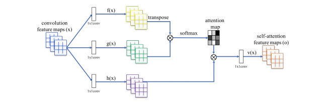

# Free form image inpainting with gated convolution

Origin: https://arxiv.org/pdf/1806.03589v2.pdf

### Disclaimer

My implementation of SN-PatchGAN does not use contextual attention layer sudjested in
the original paper. Instead I use self-attenstion layer introduced in
[Self-Attention Generative Adversarial Networks](https://arxiv.org/pdf/1805.08318.pdf).
These two approaches share the same idea and I decided to use self-attention layer
for the reason of simplicity of self-attenstion layer.

